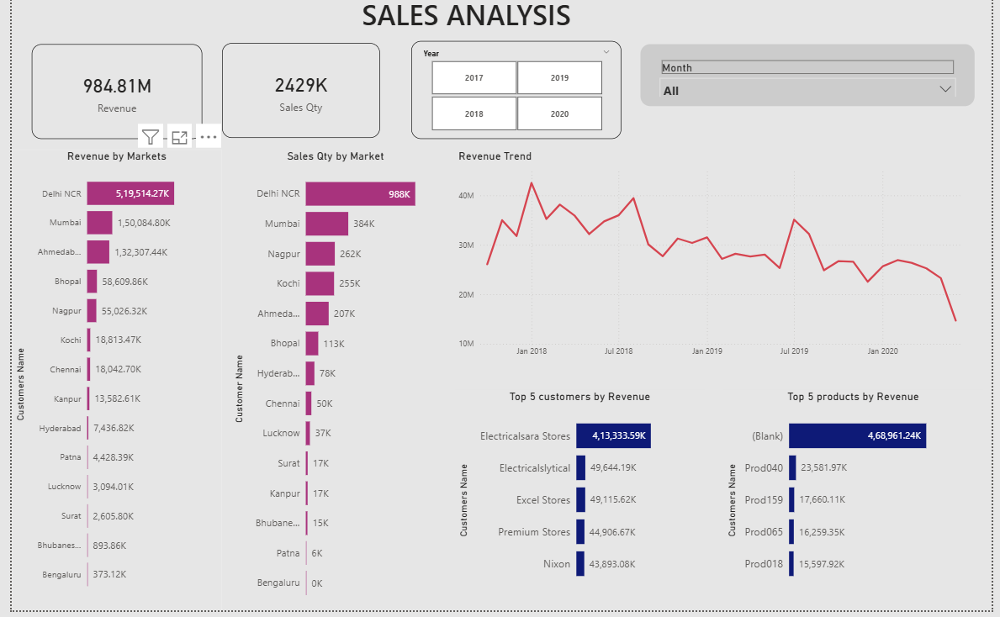
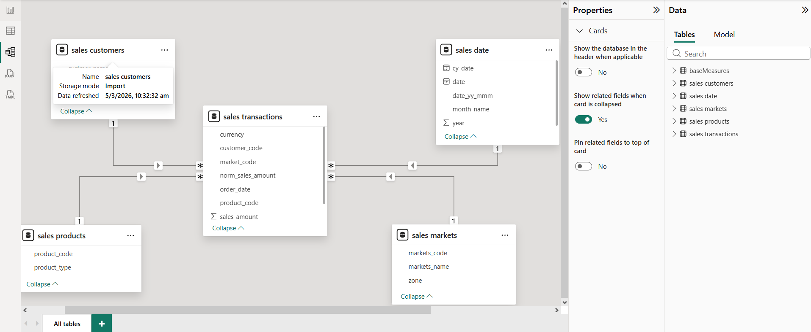

# Power BI Sales Analysis – Atliq Hardwares

## Project Overview
This project analyzes sales data for **Atliq Hardwares** using Power BI.  
The goal of the dashboard is to generate meaningful business insights from raw sales data.

The dashboard helps stakeholders understand revenue performance, top markets, customers, and product trends.

---

## Tools Used
- Power BI
- MySQL
- Data Modeling
- Data Visualization

---

## Key Metrics
- Total Revenue: 984.81M
- Total Sales Quantity: 2429K
- Top Market: Delhi NCR
- Top Customer: Electricalsara Stores

---

## Dashboard Insights

The dashboard provides insights into:

- Revenue trend over time
- Market-wise sales performance
- Top customers contributing to revenue
- Top performing products
- Sales quantity distribution

---

## Data Model

The project follows a **star schema data model**.

Fact Table:
- sales_transactions

Dimension Tables:
- sales_customers
- sales_products
- sales_markets
- sales_date

---

## Dataset

The dataset was stored in a **MySQL database** and connected to Power BI for analysis.

The repository includes the database dump file that can be imported into MySQL to recreate the dataset.

---

## Real World Data Issue

While analyzing **Top 5 Products by Revenue**, a **blank product category** appears.

This occurs because some transactions contain **missing or unmatched product codes**, which is a common data quality issue in real-world datasets.

---

## Power BI Dashboard File

Download the Power BI dashboard file here:

[Download PBIX File](Sales_Analysis.pbix)

---

## Author

Raghupathy M  
Aspiring Data Analyst
